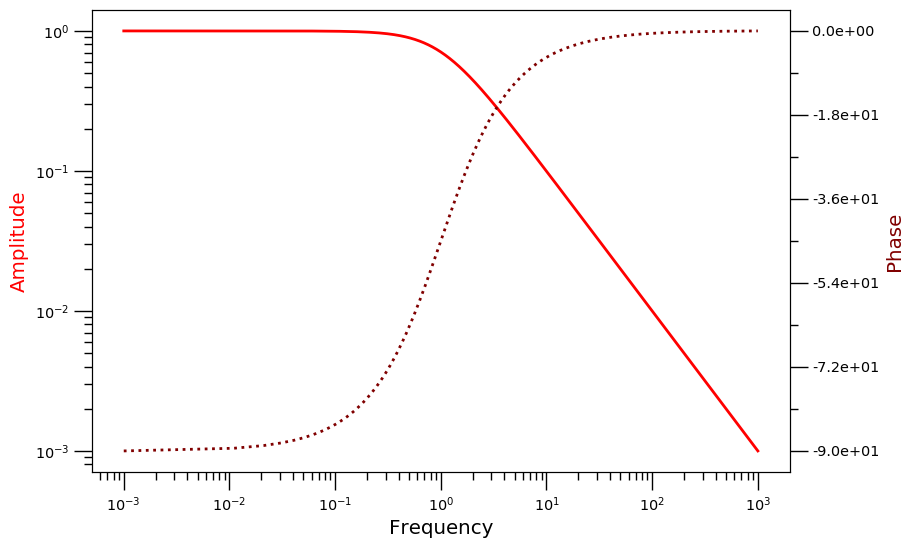

## Package for daily use of Python
### Install
This package was tested on Windows 10, Fedora and ArchLinux.

You will want to modify the code and adapt it to your taste. I advise you to download the code in an easily accessible folder and install it in your python environment in developer mode. Any further modification to the code in your folder will be effective immediately when you import the package in a python console.
```
$ git clone git@github.com:Alienor134/alienlab.git
$ cd alienlab
$ python setup.py develop
```

### Use
#### Plot

Example of use:

Simple plot, takes as input X and Y, arrays or lists of arrays when plotting multiple curves.
```
import numpy as np
import alienlab.plot as figure
X = np.linspace(0, 13, 1000)
Y = [np.cos(X), np.cos(2*X)]

p = figure.PlotFigure(X, Y)
p.label_list = ['w = 1', 'w = 2']
p.title = 'Example'
p.xlabel = 'x'
p.ylabel = 'y'
fig = p.plotting()
``` 


Plot with 2 separate y-axis. Possibility to select axis scale (regular, loglog, semilogx, semilogy)
```
W = np.linspace(0.001, 1000, 100000)
Ac = W /(W**2 + 1)
As = -1/(W**2 + 1)
A = np.sqrt(Ac**2 + As**2)
angle = np.arctan(As/Ac) * 180 / np.pi

g = alien.PlotFigure()
g.xval = W
g.yval = A
g.x2val = W
g.y2val = angle
g.title = 'Bode plot'
g.xlabel = 'Frequency'
g.ylabel = 'Amplitude'
g.y2label = 'Phase'
g.label2_list = 'Phase'
g.label_list = ['Amplitude']
g.ylog = 'loglog'
g.y2log = 'semilogx'
f = g.coplotting()
```


## Images
TODO

## io
TODO
